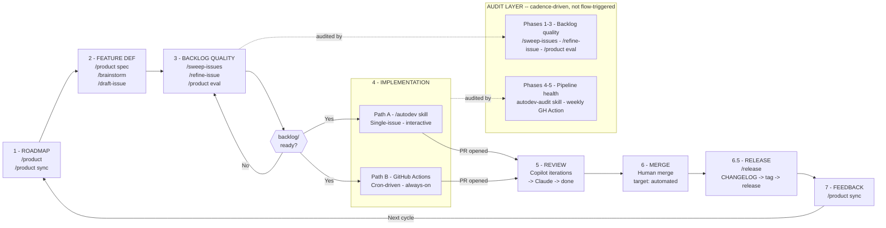

# Product Development Lifecycle

> The authoritative map of how work flows from roadmap to shipped feature.

Eight sequential phases. Two parallel implementation paths. One cross-cutting audit
layer. Every skill and workflow maps to exactly one place in this diagram.

---

## Diagram



---

## Phase 1 -- Roadmap

**What**: Strategic direction. Understand what the project needs next before any work starts.

**When to run**: At the start of any work session, before picking up new features, or
when the direction feels unclear. Also after a release cycle to reorient.

| Implementation | How to invoke | What it does |
|----------------|--------------|--------------|
| `/product` | Claude CLI skill | Full health check: phase gaps, vision drift, synergy map, ranked priorities |
| `/product sync` | Claude CLI skill | Reconcile VISION.md + STATUS.md with what's actually shipped |
| `/product spec` | Claude CLI skill | Draft a spec for the highest-value unspecced roadmap feature |

**Output**: Prioritized feature list, updated living docs, spec documents in
`docs/internal/specs/`.

**Gate to Phase 2**: A clear priority and (for complex features) a spec doc exists.

---

## Phase 2 -- Feature Definition

**What**: Turn roadmap priorities into well-formed, implementation-ready GitHub issues.

**When to run**: After a `/product` health check surfaces priorities, or when a specific
idea needs to be captured.

| Implementation | How to invoke | What it does |
|----------------|--------------|--------------|
| `/product spec "idea"` | Claude CLI skill | Vision filter (identity, principle, phase, replacement tests) -> spec if it passes -> issue |
| `/product spec` | Claude CLI skill | Auto-picks highest-value unspecced feature -> spec -> issue |
| `/brainstorm [area]` | Claude CLI skill | Exploratory ideation in a focus area -> ideas -> selected idea -> issue |
| `/draft-issue "idea"` | Claude CLI skill | Ad-hoc path: rough idea -> iterative drafting -> issue (no spec required) |

**Output**: GitHub issues with full template: summary, architecture, integration points,
acceptance criteria, documentation requirements.

**When to spec vs. draft**:
- New subsystem, new domain, or cross-feature integration -> `/product spec` first, then issue
- Small enhancement to existing functionality -> `/draft-issue` is sufficient

**Gate to Phase 3**: GitHub issue exists and is open.

---

## Phase 3 -- Backlog Quality

**What**: Ensure every issue that enters the implementation queue is specific, correct,
and achievable. The `backlog/ready` label is the quality gate between discovery and building.

**When to run**: Before any implementation batch. After issues accumulate from Phase 2.

| Implementation | How to invoke | What it does |
|----------------|--------------|--------------|
| `/sweep-issues [label]` | Claude CLI skill | Scores all open issues on quality checklist. Labels: `backlog/needs-refinement` or suggests `backlog/ready` |
| `/refine-issue [N]` | Claude CLI skill | Interactive Q&A to fill gaps in a `backlog/needs-refinement` issue. Suggests `backlog/ready` when bar is met |
| `/product eval N` | Claude CLI skill | Vision + phase + principle fit check for a single issue. Output: READY / REFINE / DECLINE |

**Output**: Issues labeled `backlog/ready` with verified acceptance criteria, architecture
notes, and defined scope.

**Gate to Phase 4**: Issue has `backlog/ready` label.

---

## Phase 4 -- Implementation

**What**: Build the feature. Two distinct paths -- choose based on context.

**Gate in**: Issue has `backlog/ready` label.

### Path A -- `/autodev` Skill

**What it is**: A Claude Code skill (`/autodev`) that implements a single issue in a
fresh worktree and opens a PR. Human-triggered, single-session.

**When to use**: Interactive implementation -- you want to watch it happen, provide
guidance mid-flight, or implement a specific issue on demand.

```
/autodev         -- auto-pick highest-value backlog/ready issue
/autodev 42      -- implement specific issue #42
/autodev 42 "name"  -- override branch name suffix
```

**Steps**: Fetch issue -> create worktree -> implement -> test + build ->
commit -> open PR with verified acceptance criteria.

**Labels**: `via/autodev` on PR. Removes `agent/implementing` from issue via PR close.

### Path B -- GitHub Actions Pipeline

**What it is**: An event-driven GitHub Actions pipeline with four workflows:
`autodev-dispatch` -> `autodev-implement` -> `autodev-review-fix` -> `claude-code-review`.

**When to use**: Always-on background automation. Runs on a configurable cron (default:
every hour) without human input. The production autonomous pipeline.

```
autodev-dispatch     -- Cron (configurable). Picks oldest backlog/ready
                       issue, labels agent/implementing, triggers implement.
autodev-implement    -- Creates branch, runs agent, pushes, opens PR.
                       PR triggers CI + Copilot review.
autodev-review-fix   -- Routes fixes by review phase (see Phase 5).
claude-code-review   -- Triggered by agent/review-claude label or @claude mention.
```

**Labels**: `via/actions` on PR. Phase tracked in PR body HTML comment:
`<!-- autodev-state: {"phase": "copilot", "copilot_iterations": 0} -->`

---

**Both paths converge here -- PR is open.**

---

## Phase 5 -- Review

**What**: Automated review iteration until the PR is approved and ready for human merge.

### Review Pipeline (GitHub Actions)

```
PR opened
    |
    +-- CI runs (test + build)
    |
    +-- Copilot review posts
            |
    autodev-review-fix (phase: copilot)
            +-- Has comments + iteration < 3  -> agent fixes -> push -> loop
            +-- Has comments + iteration >= 3 -> transition to claude phase
            +-- No comments                  -> transition to claude phase
                        |
            autodev-review-fix adds label: agent/review-claude
                        |
            claude-code-review.yml triggers
                        |
    autodev-review-fix (phase: claude)
            +-- Agent addresses feedback + creates follow-up issues for unresolved items
                        |
            Phase -> done, completion comment posted
```

Copilot reviews iterate up to 3 times OR until Copilot has no actionable comments,
whichever comes first. Then 1 Claude review pass. If at any point an agent fix fails,
the PR is labeled `human/blocked`.

**Circuit breakers**:
- Copilot: max iterations before escalating to Claude (configurable in `forge.toml`)
- Claude: 1 final fix cycle
- Timeouts: configurable implementation and review-fix timeouts
- Max turns: configurable agent turn limits

**Gate to Phase 6**: Phase state is `done`. PR is approved or has completion comment.

---

## Phase 6 -- Merge

**What**: Ship it.

**Current default**: Human reviews and merges. CODEOWNERS reviews everything.

**Auto-merge criteria** (all must be true before enabling):

*Technical prerequisites*:
- Branch protection configured with required status checks
- GitHub auto-merge enabled on the repository
- Authentication token has merge permissions

*Per-PR gate conditions*:
- All required CI checks pass
- Review pipeline phase is `done` (autodev-state HTML comment)
- No `human/blocked` label present
- Origin is trusted (`via/autodev` or `via/actions`)
- No unresolved review conversations

**On merge**:
- Issue auto-closes via `Closes #N` / `Fixes #N` in PR body
- `agent/implementing` label removed
- Branch deleted

---

## Phase 6.5 -- Release

**What**: Ship accumulated work to users. Turns merged PRs into a versioned release that
users can install. This phase is intentionally human-triggered -- the decision to cut a
release is a product judgment call, not something the pipeline does automatically.

**When to run**: After a meaningful batch of features or fixes has merged to the base
branch and you want to ship them to users.

| Implementation | How to invoke | What it does |
|----------------|--------------|--------------|
| `/release` | Claude CLI skill | Full release flow: analyze PRs -> propose semver -> draft CHANGELOG -> confirm -> tag -> push |
| `/release check` | Claude CLI skill | Dry-run: shows what would be released, proposed version, CHANGELOG preview -- no side effects |
| `/release notes` | Claude CLI skill | Draft CHANGELOG entry only, no commits or tags |

**Steps** (full `/release` flow):
1. Fetch all merged PRs since last tag
2. Categorize by conventional commit type (feat/fix/refactor/...)
3. Propose semver bump with reasoning (patch/minor/major)
4. Draft user-facing CHANGELOG entry
5. Run pre-release checklist (no blocked PRs, CHANGELOG accuracy)
6. Present full summary -- **wait for explicit human confirmation**
7. Update CHANGELOG.md, commit
8. Create git tag and push -> triggers release pipeline

**Gate to Phase 7**: Tag pushed, release published.

---

## Phase 7 -- Feedback

**What**: Close the loop. Update the living docs so Phase 1 starts from accurate ground.

| Implementation | How to invoke | What it does |
|----------------|--------------|--------------|
| `/product sync` | Claude CLI skill | Reviews merged PRs, updates STATUS.md Done lists, updates VISION.md, commits |

**When to run**: After a release, after a batch of merges, or whenever STATUS.md feels stale.

**Output**: Committed updates to `docs/internal/STATUS.md` and `docs/internal/VISION.md`.

**Loop**: Feeds directly into Phase 1 (`/product` health check reads the updated docs).

---

## Audit Layer -- Cross-Cutting

The audit layer runs on cadence, not triggered by the main pipeline. It evaluates the
*health of the process itself*, not individual features.

### Backlog & Roadmap Quality (Phases 1-3)

| Implementation | How to invoke | Cadence | What it checks |
|----------------|--------------|---------|----------------|
| `/sweep-issues` | Claude CLI skill | Before each work batch | Open issue quality against quality checklist |
| `/refine-issue` | Claude CLI skill | After sweep flags gaps | Individual issue refinement via Q&A |
| `/product eval N` | Claude CLI skill | Ad-hoc | Single issue: vision, phase, principle fit |

### Pipeline Health (Phases 4-5)

| Implementation | How to invoke | Cadence | What it checks |
|----------------|--------------|---------|----------------|
| `autodev-audit` GH Action | GitHub Actions (manual or weekly cron Mon 9AM UTC) | Weekly | PR quality, code patterns, review themes, stale state |

---

## Quick Reference -- "What do I run right now?"

| Situation | Phase | Run |
|-----------|-------|-----|
| Starting a new session, don't know what to do | 1 | `/product` |
| Living docs feel stale after merges | 1/7 | `/product sync` |
| Have a specific idea, want to know if it fits | 2 | `/product spec "idea"` |
| Want to spec the next obvious roadmap feature | 2 | `/product spec` |
| Have a quick enhancement to capture | 2 | `/draft-issue "idea"` |
| Want to explore a feature area loosely | 2 | `/brainstorm [area]` |
| Backlog has grown, preparing a work batch | 3 | `/sweep-issues` |
| An issue needs improvement | 3 | `/refine-issue N` |
| Checking if one issue is ready to build | 3 | `/product eval N` |
| Implement a specific issue, interactive | 4A | `/autodev N` |
| Let the background pipeline handle it | 4B | GitHub Actions (always running) |
| Review cycle seems stuck | 5 | Check `autodev-review-fix` workflow logs |
| PR is done, ready to ship | 6 | Human merge |
| Features merged, want to ship to users | 6.5 | `/release` |
| Want to preview what a release would look like | 6.5 | `/release check` |
| Post-release, update what shipped | 7 | `/product sync` |
| Backlog quality feels inconsistent | Audit | `/sweep-issues` |
| Pipeline feels slow or error-prone | Audit | Check `autodev-audit` GH Action reports |

---

## Skill -> Phase Map

| Skill / Workflow | Layer | Phase |
|-----------------|-------|-------|
| `/product` | Main | 1 -- Roadmap |
| `/product sync` | Main | 1/7 -- Roadmap / Feedback |
| `/product spec` | Main | 1/2 -- Roadmap / Feature Definition |
| `/product spec "idea"` | Main | 2 -- Feature Definition |
| `/brainstorm` | Main | 2 -- Feature Definition |
| `/draft-issue` | Main | 2 -- Feature Definition |
| `/sweep-issues` | Main + Audit | 3 -- Backlog Quality |
| `/refine-issue` | Main + Audit | 3 -- Backlog Quality |
| `/product eval N` | Main + Audit | 3 -- Backlog Quality |
| `/autodev` | Main | 4A -- Implementation |
| GitHub Actions autodev pipeline | Main | 4B + 5 -- Implementation + Review |
| `autodev-review-fix` workflow | Main | 5 -- Review |
| `claude-code-review` workflow | Main | 5 -- Review |
| Human merge | Main | 6 -- Merge |
| `/release` | Main | 6.5 -- Release |
| `/release check` | Main | 6.5 -- Release (dry-run) |
| `/release notes` | Main | 6.5 -- Release (notes only) |
| `autodev-audit` GH Action | Audit | 4-5 -- Pipeline health |
