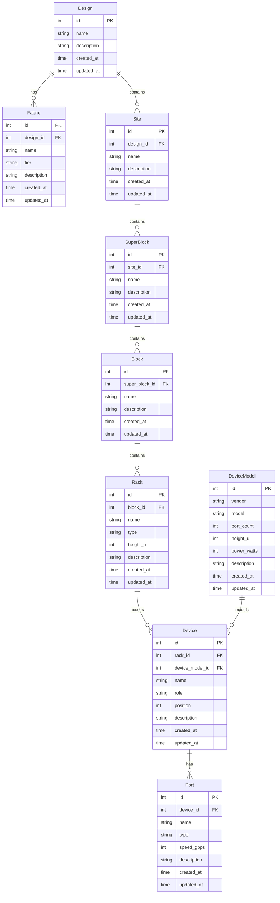

# Data Model ERD

This document describes the core domain model for fabrik and the relationships
between entities.

## Entity Relationship Diagram

```
Design
  ├── Fabric  (tier: frontend | backend)
  └── Site
        └── SuperBlock
              └── Block
                    └── Rack  (type: physical | logical)
                          └── Device  (role: spine | leaf | super_spine | server | other)
                                └── Port  (type: ethernet | fiber | dac | other)

DeviceModel  (referenced by Device)
```

### ERD (Mermaid)



## Hierarchy

Physical placement follows a strict containment hierarchy:

```
Site → SuperBlock → Block → Rack → Device → Port
```

- **Site**: Physical datacenter building or campus.
- **SuperBlock**: A data hall, pod, or zone within a site.
- **Block**: A row or cluster of racks within a super-block.
- **Rack**: A physical cabinet (42U standard) or logical grouping.
- **Device**: A network switch or server installed at a rack position.
- **Port**: An individual switchport or NIC port on a device.

## Fabric Model

Fabric is separate from the physical hierarchy. A Fabric represents a Clos
network tier (front-end customer-facing or back-end storage/cluster) that spans
devices across the physical hierarchy.

## Device Catalog

`DeviceModel` is a shared catalog of hardware platforms. Multiple `Device`
instances can reference the same `DeviceModel`. The model captures:

- Vendor and model string (unique pair)
- Port count and form factor (height in rack units)
- Typical power draw (watts)

## Schema Notes

- All tables use `INTEGER PRIMARY KEY AUTOINCREMENT` with SQLite.
- `ON DELETE CASCADE` is used throughout the containment hierarchy so that
  deleting a parent automatically removes all children.
- `PRAGMA foreign_keys=ON` is set at connection open time.
- `PRAGMA journal_mode=WAL` is set for better concurrent read performance.
- All timestamps default to `strftime('%Y-%m-%dT%H:%M:%fZ', 'now')` in UTC.
